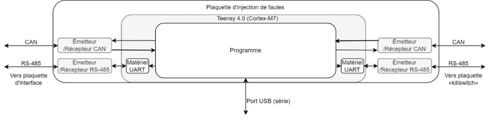

# sonia_embed_error_injection
This code is use to test the error testing capabilities of the RS485 and CAN bus protocole implementation created as part of a special projet.

The fault injector sit in betwen the client and the host on both RS485 and CAN bus. It decodes incoming data frame, pass the data frame on the other side and, optionnaly corrupts them.

To use this code you will need Arduino IDE and the teensyduino extension
